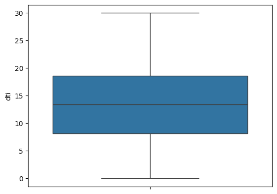
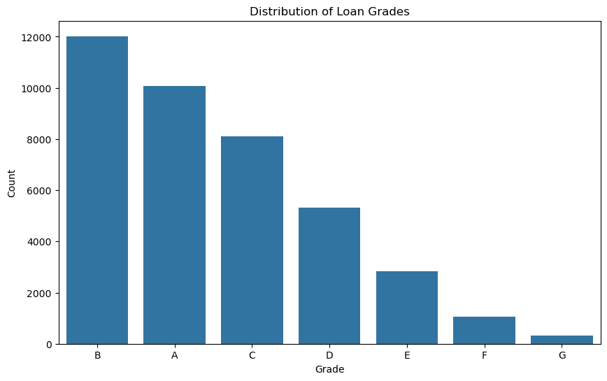
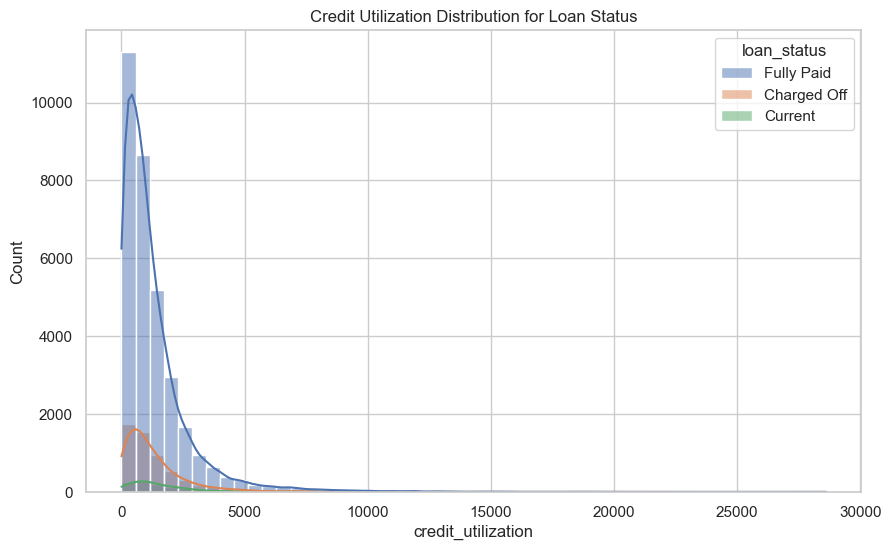

# Upgrad-CS67-LendingClubCaseStudy

This project is a comprehensive analysis of Lending Club loan data using Python libraries like Pandas, NumPy, Matplotlib, and Seaborn. The aim is to explore, clean, and analyze the dataset to extract insights regarding loan applications, their status, and other factors influencing loan repayment.

---

## Table of Contents
1. [Libraries Used](#libraries-used)
2. [Dataset Loading](#dataset-loading)
3. [Initial Data Exploration](#initial-data-exploration)
4. [Data Cleanup](#data-cleanup)
5. [Addition Metric Generation](#additional-metric-generation)
6. [Univariate Analysis](#univariate-analysis)
7. [Segmented Analysis](#analysis)
8. [Bivariate Analysis](#analysis)
9. [Multi-variate Analysis](#analysis)
10. [Final Dataset](#final-dataset)
11. [Conclusion](#conclusion)

---

## Libraries Used
```python
import pandas as pd
import numpy as np
import matplotlib.pyplot as plt
import seaborn as sns
```

---

## Dataset Loading

```python
# Loading dataset to pandas dataframe
file_path = r"./loan.csv"
df = pd.read_csv(file_path)
# Checking few values for the given dataset
df.head()
```

| id | member_id | loan_amnt | funded_amnt | funded_amnt_inv | term | int_rate | installment | grade | sub_grade | ... | num_tl_90g_dpd_24m | num_tl_op_past_12m | pct_tl_nvr_dlq | percent_bc_gt_75 | pub_rec_bankruptcies | tax_liens | tot_hi_cred_lim | total_bal_ex_mort | total_bc_limit | total_il_high_credit_limit |
| :---: | :---: | :---: | :---: | :---: | :---: | :---: | :---: | :---: | :---: | :---: | :---: | :---: | :---: | :---: | :---: | :---: | :---: | :---: | :---: | :---: |
| 0 | 1077501 | 1296599 | 5000 | 5000 | 4975.0 | 36 months | 10.65% | 162.87 | B | B2 | ... | NaN | NaN | NaN | NaN | 0.0 | 0.0 | NaN | NaN | NaN | NaN |
| 1 | 1077430 | 1314167 | 2500 | 2500 | 2500.0 | 60 months | 15.27% | 59.83 | C | C4 | ... | NaN | NaN | NaN | NaN | 0.0 | 0.0 | NaN | NaN | NaN | NaN |
| 2 | 1077175 | 1313524 | 2400 | 2400 | 2400.0 | 36 months | 15.96% | 84.33 | C | C5 | ... | NaN | NaN | NaN | NaN | 0.0 | 0.0 | NaN | NaN | NaN | NaN |
| 3 | 1076863 | 1277178 | 10000 | 10000 | 10000.0 | 36 months | 13.49% | 339.31 | C | C1 | ... | NaN | NaN | NaN | NaN | 0.0 | 0.0 | NaN | NaN | NaN | NaN |
| 4 | 1075358 | 1311748 | 3000 | 3000 | 3000.0 | 60 months | 12.69% | 67.79 | B | B5 | ... | NaN | NaN | NaN | NaN | 0.0 | 0.0 | NaN | NaN | NaN | NaN |


---

## Initial Data Exploration

Checking the basic information on the data provided:

```python
# Checking the detailed info of the given dataset
df.info(verbose=1)
```

    <class 'pandas.core.frame.DataFrame'>
    RangeIndex: 39717 entries, 0 to 39716
    Data columns (total 111 columns):
     #    Column                          Dtype  
    ---   ------                          -----  
     0    id                              int64  
     1    member_id                       int64  
     2    loan_amnt                       int64  
     3    funded_amnt                     int64  
     4    funded_amnt_inv                 float64
     5    term                            object 
     6    int_rate                        object 
     7    installment                     float64
     8    grade                           object 
     9    sub_grade                       object 
     10   emp_title                       object 
     11   emp_length                      object 
     12   home_ownership                  object 
     13   annual_inc                      float64
     14   verification_status             object 
     15   issue_d                         object 
     16   loan_status                     object 
     17   pymnt_plan                      object 
     18   url                             object 
     19   desc                            object 
     20   purpose                         object 
     21   title                           object 
     22   zip_code                        object 
     23   addr_state                      object 
     24   dti                             float64
     25   delinq_2yrs                     int64  
     26   earliest_cr_line                object 
     27   inq_last_6mths                  int64  
     28   mths_since_last_delinq          float64
     29   mths_since_last_record          float64
     30   open_acc                        int64  
     31   pub_rec                         int64  
     32   revol_bal                       int64  
     33   revol_util                      object 
     34   total_acc                       int64  
     35   initial_list_status             object 
     36   out_prncp                       float64
     37   out_prncp_inv                   float64
     38   total_pymnt                     float64
     39   total_pymnt_inv                 float64
     40   total_rec_prncp                 float64
     41   total_rec_int                   float64
     42   total_rec_late_fee              float64
     43   recoveries                      float64
     44   collection_recovery_fee         float64
     45   last_pymnt_d                    object 
     46   last_pymnt_amnt                 float64
     47   next_pymnt_d                    object 
     48   last_credit_pull_d              object 
     49   collections_12_mths_ex_med      float64
     50   mths_since_last_major_derog     float64
     51   policy_code                     int64  
     52   application_type                object 
     53   annual_inc_joint                float64
     54   dti_joint                       float64
     55   verification_status_joint       float64
     56   acc_now_delinq                  int64  
     57   tot_coll_amt                    float64
     58   tot_cur_bal                     float64
     59   open_acc_6m                     float64
     60   open_il_6m                      float64
     61   open_il_12m                     float64
     62   open_il_24m                     float64
     63   mths_since_rcnt_il              float64
     64   total_bal_il                    float64
     65   il_util                         float64
     66   open_rv_12m                     float64
     67   open_rv_24m                     float64
     68   max_bal_bc                      float64
     69   all_util                        float64
     70   total_rev_hi_lim                float64
     71   inq_fi                          float64
     72   total_cu_tl                     float64
     73   inq_last_12m                    float64
     74   acc_open_past_24mths            float64
     75   avg_cur_bal                     float64
     76   bc_open_to_buy                  float64
     77   bc_util                         float64
     78   chargeoff_within_12_mths        float64
     79   delinq_amnt                     int64  
     80   mo_sin_old_il_acct              float64
     81   mo_sin_old_rev_tl_op            float64
     82   mo_sin_rcnt_rev_tl_op           float64
     83   mo_sin_rcnt_tl                  float64
     84   mort_acc                        float64
     85   mths_since_recent_bc            float64
     86   mths_since_recent_bc_dlq        float64
     87   mths_since_recent_inq           float64
     88   mths_since_recent_revol_delinq  float64
     89   num_accts_ever_120_pd           float64
     90   num_actv_bc_tl                  float64
     91   num_actv_rev_tl                 float64
     92   num_bc_sats                     float64
     93   num_bc_tl                       float64
     94   num_il_tl                       float64
     95   num_op_rev_tl                   float64
     96   num_rev_accts                   float64
     97   num_rev_tl_bal_gt_0             float64
     98   num_sats                        float64
     99   num_tl_120dpd_2m                float64
     100  num_tl_30dpd                    float64
     101  num_tl_90g_dpd_24m              float64
     102  num_tl_op_past_12m              float64
     103  pct_tl_nvr_dlq                  float64
     104  percent_bc_gt_75                float64
     105  pub_rec_bankruptcies            float64
     106  tax_liens                       float64
     107  tot_hi_cred_lim                 float64
     108  total_bal_ex_mort               float64
     109  total_bc_limit                  float64
     110  total_il_high_credit_limit      float64
    dtypes: float64(74), int64(13), object(24)
    memory usage: 33.6+ MB


Checking attributes with no values:

```python
# Evaluating the fields with nan values
missing_value_percentage=df.isna().sum()*100/df.shape[0]
missing_value_percentage.sort_values(ascending=False)
```

    verification_status_joint    100.0
    annual_inc_joint             100.0
    mo_sin_old_rev_tl_op         100.0
    mo_sin_old_il_acct           100.0
    bc_util                      100.0
                                 ...  
    delinq_amnt                    0.0
    policy_code                    0.0
    earliest_cr_line               0.0
    delinq_2yrs                    0.0
    id                             0.0
    Length: 111, dtype: float64


---

## Data Cleanup

1. Dropping all attributes with more than 90% missing values:

```python
# Evaluating the fields with nan values in the updated dataframe
missing_value_percentage=df.isna().sum()*100/df.shape[0]
missing_value_percentage.sort_values(ascending=False)

# Based on the observation of above data, dropping all fields with more than 90% nan data
df.drop(df.columns[missing_value_percentage > 90].tolist(), axis='columns', inplace=True)
```

2. Dropping attributes with same data for all records, as these attributes would not contribute to any analysis:

```python
# collections_12_mths_ex_med: 0
# policy_code: 1
# acc_now_delinq: 0
# chargeoff_within_12_mths: 0
# delinq_amnt: 0
# tax_liens: 0
# application_type: INDIVIDUAL
# pymnt_plan: n

# Dropping these columns
df.drop(['collections_12_mths_ex_med', 'policy_code', 'acc_now_delinq', 'chargeoff_within_12_mths', 'delinq_amnt', 'tax_liens', 'application_type', 'pymnt_plan'], axis='columns', inplace=True)
```

3. Dropping all attributes with unstructured text data, as these could not be utilised for programmable inference:

```python
# Dropping unnecessary or unstructured text attributes
df.drop(columns=['desc', 'title', 'id', 'member_id', 'url', 'zip_code', 'sub_grade', 'emp_title'], axis='columns', inplace=True)
```

4. Converting attribute `term` to interger:

```python
# Converting `term` to integer
df['term'] = df.term.apply(lambda x: int(x.replace(' months', '')))
df.term.value_counts(ascending=False)
```

5. Converting attribute `int_rate` to floating values:

```python
# Converting `int_rate` to float
df['int_rate'] = df.int_rate.apply(lambda x: float(str(x).replace('%', '')))
df['int_rate'] = df.int_rate.astype(float)
df.int_rate.value_counts(ascending=False)
```

6. Converting attribute `emp_length` from string values to their integer alternatives:

```python
# Extracting integer values for `emp_length`
def extract_num(val):
  val = str(val).strip()

  if val.startswith("10+"):
    return 10
  elif val.startswith("< 1") or val == "nan":
    return 0
  else:
    return int(val.split(' ')[0])

df['emp_length'] = df.emp_length.apply(extract_num)
```

7. Converting attributes with dates to actual datetime objects:

```python
# Importing datetime library
from datetime import datetime

# Custoom method for converting string/null to datetime object
def convert_to_datetime_obj(x):
    if x == "epoch":
        return datetime(1970, 1, 1, 0, 0, 0)

    return datetime.strptime(x, '%b-%y')

# Filling null values in datetime attributes to the string 'epoch'. And then converting date fields from string to datetime object.
df['issue_d'] = df.issue_d.fillna("epoch")
df['issue_d'] = df.issue_d.apply(convert_to_datetime_obj)

df['earliest_cr_line'] = df.earliest_cr_line.fillna("epoch")
df['earliest_cr_line'] = df.earliest_cr_line.apply(convert_to_datetime_obj)

df['last_credit_pull_d'] = df.last_credit_pull_d.fillna("epoch")
df['last_credit_pull_d'] = df.last_credit_pull_d.apply(convert_to_datetime_obj)

df['last_pymnt_d'] = df.last_pymnt_d.fillna("epoch")
df['last_pymnt_d'] = df.last_pymnt_d.apply(convert_to_datetime_obj)
```

8. Imputing attribute `pub_rec_bankruptcies` with 0 in place of null/nan values:

```python
# Imputing null values in `pub_rec_bankruptcies` to 0
df['pub_rec_bankruptcies'] = df['pub_rec_bankruptcies'].fillna(0)  # Assume no bankruptcy if missing
```

9. Converting attribute `revol_util` to float and imputing missing values with the median:

```python
# Converting 'revol_util' from string to numeric, and filling missing values
df['revol_util'] = pd.to_numeric(df['revol_util'].str.replace('%', ''), errors='coerce')
df['revol_util'] = df['revol_util'].fillna(df['revol_util'].median())
```

---

## Addition Metric Generation

1. Creating addition attributes `loan_issue_year`, `loan_issue_month` from existing attribute `issue_d` for easier data segmentation:

```python
# Extracting loan issue year and month from `issue_d` field
from datetime import datetime
df["loan_issue_year"] = pd.DatetimeIndex(df.issue_d).year
df["loan_issue_month"] = pd.DatetimeIndex(df.issue_d).month
```

2. Creating addition attribute `loan_to_income_ratio` as ratio of existing attributes `loan_amnt` and `annual_inc`:

```python
# 1. Create Loan to Income Ratio
df['loan_to_income_ratio'] = df['loan_amnt'] / df['annual_inc']
```

3. Creating attribute `credit_score_proxy`:

```python
# Create an aggregated credit score proxy based on available variables (this can be adjusted)
df['credit_score_proxy'] = (100 - df['delinq_2yrs']*20 - df['inq_last_6mths']*10 + df['total_acc']*2) * (100 - df['revol_util'])
```

4. Creating attribute `missed_payments` from existing attributes `loan_status` and `total_rec_late_fee`:

```python
# If 'loan_status' is 'Charged Off' or 'Default', mark it as missed payment.
df['missed_payments'] = df['loan_status'].apply(lambda x: 1 if x in ['Charged Off', 'Default'] else 0)

# If total late fee > 0, mark as missed payments
df['missed_payments'] = df.apply(lambda x: 1 if x['total_rec_late_fee'] > 0 else x['missed_payments'], axis=1)
```

5. Creating attribute `credit_utilization` as ratio of `revol_bal` and (`open_acc`  + 1`):

```python
# Credit Utilization Rate
df['credit_utilization'] = df['revol_bal'] / (df['open_acc'] + 1)
```

6. Creating attribute `installment_to_income_ratio` as ration of `installment` and (`annual_inc` / 12):

```python
# Installment-to-Income Ratio
df['installment_to_income_ratio'] = df['installment'] / (df['annual_inc'] / 12)
```

7. Creating attribute `delinquency_risk_index` as sum of `delinq_2yrs` and `pub_rec`:

```python
# Delinquency Risk Index
df['delinquency_risk_index'] = df['delinq_2yrs'] + df['pub_rec']
```

8. Creating attribute `loan_payment_to_principal_ratio` as ratio of `total_pymnt` and `loan_amnt`:

```python
# Loan Payment to Principal Ratio
df['loan_payment_to_principal_ratio'] = df['total_pymnt'] / df['loan_amnt']
```

9. Creating attribute `loan_principal_recovery_rate` as ratio of `recoveries` and `loan_amnt`:

```python
# Loan Principal Recovery Rate
df['loan_principal_recovery_rate'] = df['recoveries'] / df['loan_amnt']
```

10. Creating attribute `loan_charge_off_rate` as ratio of `collection_recovery_fee` and `loan_amnt`:

```python
# Loan Charge-Off Rate
df['loan_charge_off_rate'] = df['collection_recovery_fee'] / df['loan_amnt']
```

11. Creating attribute `emp_length_cat` as catgories from existing attribute `emp_length`:

```python
# Employment Length as Categorical
df['emp_length_cat'] = pd.cut(df['emp_length'], bins=[-1, 1, 5, 10, 20], labels=["<1yr", "1-5yr", "5-10yr", "10+yr"])
```

12. Creating attribute `loan_status_binary` as a integer truth value for existing attribute `loan_status`:

```python
# Convert loan_status to binary where 'Charged Off' is 1 and others are 0
df['loan_status_binary'] = df['loan_status'].apply(lambda x: 1 if x == 'Charged Off' else 0)
```

13. Creating attribute `income_level` to categorise existing attribute `annual_inc`:

```python
# Create income bins and analyze loan characteristics
df['income_level'] = pd.cut(df['annual_inc'], 
                                    bins=[0, 50000, 100000, 150000, 200000, df['annual_inc'].max()], 
                                    labels=['Low', 'Medium', 'High', 'Very High', 'Top 1%'])
```

---

## UNIVARIATE ANALYSIS

1. **Loan Amount**
The listed amount of the loan applied for by the borrower. If at some point in time, the credit department reduces the loan amount, then it will be reflected in this value.

Distribution of Loan amount can provide insights into the market demand

```python
sns.histplot(df.loan_amnt)
plt.show()
```


2. **Interest Rate**
Interest Rate on the loan

Distribution of interest rate showcases the following:
- Highest profitability for the bank.
- Acceptable range of interest rates.
- High risk loans (when compared with other variables)
- Low risk loans (when compared with other variables)

```python
sns.histplot(df.int_rate)
plt.show()
```


3. **Annual Income**
The self-reported annual income provided by the borrower during registration.

Distribution of annual income indicates the existing customer segment and can point to potential customers to target.

```python
sns.histplot(df.annual_inc, bins=50)
plt.show()
```


```python
sns.boxplot(df.annual_inc)
plt.show()
```


```python
# Since the customers with extremely high income seem to be outliers, we can possibly exclude them for our analysis.
df_excluding_hii = df[df.annual_inc < 1000000]
sns.boxplot(df_excluding_hii.annual_inc)
plt.show()
```


4. **Annual Income**
The self-reported annual income provided by the borrower during registration.

This is an important metric for evaluating the borrower's ability to repay. Distribution of this metric points to the risk factor in repayment of existing loans.

```python
sns.histplot(df.dti)
plt.show()
```


```python
sns.boxplot(df.dti)
plt.show()
```



5. **Address State**
The state provided by the borrower in the loan application.

This metric provides following insights:
- State-wise demand for loans.
- Highest current cutomer base.
- Lowest current customer base.

```python
plt.figure(figsize=(15,5))
sns.histplot(df.addr_state)
plt.xticks(rotation=90)
plt.show()
```


6. **Home Ownership**
The home ownership status provided by the borrower during registration. Our values are: RENT, OWN, MORTGAGE, OTHER.

This metric helps in idenitfying customers who do not have any other long tenure loan or liability. Also, it points to the customers with higher financial stability.

```python
sns.histplot(df.home_ownership)
plt.show()
```


7. **Loan Status**
Current status of the loan.

This showcases the existing customer with unpaid loans. This indirectly also points to the total funds still getting rotated in market versus liquidity with the bank for offering loans to potential customers.

```python
sns.histplot(df.loan_status)
plt.show()
```


8. **Grade**
LC assigned loan grade.

This metric defines range of high risk loans.

```python
# Bar plot for 'grade'
plt.figure(figsize=(10,6))
sns.countplot(x='grade', data=df, order=df['grade'].value_counts().index)
plt.title('Distribution of Loan Grades')
plt.xlabel('Grade')
plt.ylabel('Count')
plt.show()
```



9. **Employment Length**
Employment length in years. Possible values are between 0 and 10 where 0 means less than one year and 10 means ten or more years.

Distribution of this metric gives insight into customers with varied employment lengths and possibly the ability to repay the loan.

```python
# Assuming 'emp_length' signifies employment status
plt.figure(figsize=(10,6))
sns.countplot(x='emp_length', data=df, order=df['emp_length'].value_counts().index)
plt.title('Employment Length Distribution')
plt.xlabel('Employment Length')
plt.ylabel('Count')
plt.xticks(rotation=45)
plt.show()
```


10. **Purpose**
A category provided by the borrower for the loan request.

Shows distribution of market demand for different types of loans.

```python
# Bar plot for 'purpose'
plt.figure(figsize=(12,6))
sns.countplot(x='purpose', data=df, order=df['purpose'].value_counts().index)
plt.title('Distribution of Loan Purpose')
plt.xlabel('Purpose')
plt.ylabel('Count')
plt.xticks(rotation=45)
plt.show()
```


11. **Loan Term**
The number of payments on the loan. Values are in months and can be either 36 or 60.

Shows distribution of loan term.

```python
# Assuming 'term' signifies loan term
plt.figure(figsize=(10,6))
sns.countplot(x='term', data=df, order=df['term'].value_counts().index)
plt.title('Loan Term Distribution')
plt.xlabel('Loan Term (months)')
plt.ylabel('Count')
plt.show()
```


12. **Loan to Income Ratio**
This is a derived metric obtained as a ratio of Loan Amount and Income. A higher ratio may signal that a borrower is over-leveraged, making it a strong predictor of default risk.

```python
# Visualize Loan to Income Ratio
plt.figure(figsize=(10,6))
sns.histplot(df['loan_to_income_ratio'], bins=30, kde=True)
plt.title('Loan to Income Ratio Distribution')
plt.xlabel('Loan to Income Ratio')
plt.ylabel('Frequency')
plt.show()
```


13. **Credit Score Proxy**
Calculating a FICO proxy based on existing credit variables. Credit scores often correlate with risk levels, and this binning will help identify risk patterns more clearly.

```python
# Credit Score Proxy Distribution
plt.figure(figsize=(10,6))
sns.histplot(df['credit_score_proxy'], bins=30, kde=True)
plt.title('Credit Score Proxy Distribution')
plt.xlabel('Credit Score Proxy')
plt.ylabel('Frequency')
plt.show()
```


14. **Missed Payments**
If the data includes missed payments, create a metric that counts them. More missed payments would strongly indicate the risk of future default.

```python
# Missed Payments Distribution
plt.figure(figsize=(10,6))
sns.countplot(x='missed_payments', data=df)
plt.title('Missed Payments Distribution')
plt.xlabel('Missed Payments (0 = No, 1 = Yes)')
plt.ylabel('Count')
plt.show()
```


---

## Segmented Analysis

```python
# Set up the visual style
sns.set(style="whitegrid")
```

1. **By Categorised Employment Length (emp_length_cat):**
Analyze key variables like loan_amnt, int_rate, and term to see how loan characteristics differ by employment length category and whether certain employment lengths are more prone to default.

```python
# Analyze loan amount, interest rate, and term for each employment length category

plt.figure(figsize=(10, 6))
sns.boxplot(x='emp_length_cat', y='loan_amnt', hue='loan_status', data=df)
plt.title('Loan Amount by Employment Length Category and Loan Status')
plt.show()

plt.figure(figsize=(10, 6))
sns.boxplot(x='emp_length_cat', y='int_rate', hue='loan_status', data=df)
plt.title('Interest Rate by Employment Length Category and Loan Status')
plt.show()

plt.figure(figsize=(10, 6))
sns.countplot(x='term', hue='emp_length_cat', data=df)
plt.title('Loan Term Distribution by Employment Length Category')
plt.show()
```


2. **By Income Level (annual_inc):**
Segment the annual_inc column into bins (e.g., low, medium, high income) and examine variables like loan_amnt, loan_term, and int_rate to check for any trends in defaults based on income levels.

```python
plt.figure(figsize=(10, 6))
sns.boxplot(x='income_level', y='loan_amnt', hue='loan_status', data=df)
plt.title('Loan Amount by Income Level and Loan Status')
plt.show()

plt.figure(figsize=(10, 6))
sns.boxplot(x='income_level', y='int_rate', hue='loan_status', data=df)
plt.title('Interest Rate by Income Level and Loan Status')
plt.show()

plt.figure(figsize=(10, 6))
sns.countplot(x='term', hue='income_level', data=df)
plt.title('Loan Term Distribution by Income Level')
plt.show()
```


3. **By Region (addr_state):**
Break down by region (US states) to identify if certain regions have a higher proportion of risky loans. Analyze loan_amnt and int_rate for regional patterns.

```python
# Analyze loan amount and interest rate by region
plt.figure(figsize=(12, 8))
sns.boxplot(x='addr_state', y='loan_amnt', hue='loan_status', data=df)
plt.title('Loan Amount by Region and Loan Status')
plt.xticks(rotation=90)
plt.show()

plt.figure(figsize=(12, 8))
sns.boxplot(x='addr_state', y='int_rate', hue='loan_status', data=df)
plt.title('Interest Rate by Region and Loan Status')
plt.xticks(rotation=90)
plt.show()
```


4. **By Loan Purpose (purpose):**
Examine how loan characteristics vary based on the purpose of the loan and whether specific purposes are linked to higher default rates.

```python
# Analyze loan amount, interest rate, and term by loan purpose
plt.figure(figsize=(12, 8))
sns.boxplot(x='purpose', y='loan_amnt', hue='loan_status', data=df)
plt.title('Loan Amount by Loan Purpose and Loan Status')
plt.xticks(rotation=90)
plt.show()

plt.figure(figsize=(12, 8))
sns.boxplot(x='purpose', y='int_rate', hue='loan_status', data=df)
plt.title('Interest Rate by Loan Purpose and Loan Status')
plt.xticks(rotation=90)
plt.show()

plt.figure(figsize=(12, 8))
sns.countplot(x='term', hue='purpose', data=df)
plt.title('Loan Term Distribution by Loan Purpose')
plt.xticks(rotation=90)
plt.show()
```


---

# Bivariate Analysis

1. **Credit Utilization vs. Loan Status**

```python
# . Credit Utilization vs. Loan Status
plt.figure(figsize=(10, 6))
sns.histplot(data=df, x='credit_utilization', hue='loan_status', kde=True, bins=50)
plt.title('Credit Utilization Distribution for Loan Status')
plt.show()
```



2. **Installment-to-Income Ratio vs. Loan Status**

```python
# . Installment-to-Income Ratio vs. Loan Status
plt.figure(figsize=(10, 6))
sns.boxplot(x='loan_status', y='installment_to_income_ratio', data=df)
plt.title('Installment-to-Income Ratio vs Loan Status')
plt.show()
```


3. **Delinquency Risk Index vs. Loan Status**

```python
# . Delinquency Risk Index vs. Loan Status
plt.figure(figsize=(10, 6))
sns.countplot(x='delinquency_risk_index', hue='loan_status', data=df)
plt.title('Delinquency Risk Index by Loan Status')
plt.show()
```


4. **Loan Payment to Principal Ratio vs. Loan Status**

```python
# . Loan Payment to Principal Ratio vs. Loan Status
# Loan Payment to Principal Ratio by Loan Status - Boxplot (Better Visualization)
plt.figure(figsize=(10, 6))
sns.boxplot(x='loan_status', y='loan_payment_to_principal_ratio', data=df)
plt.title('Loan Payment to Principal Ratio by Loan Status')
plt.show()
```


5. **Loan Principal Recovery Rate vs. Loan Status**

```python
# . Loan Principal Recovery Rate vs. Loan Status
plt.figure(figsize=(10, 6))
sns.violinplot(x='loan_status', y='loan_principal_recovery_rate', data=df)
plt.title('Loan Principal Recovery Rate by Loan Status')
plt.show()
```


6. **Loan Charge-Off Rate by Grade**

```python
# . Loan Charge-Off Rate by Grade
plt.figure(figsize=(10, 6))
sns.barplot(x='grade', y='loan_charge_off_rate', data=df)
plt.title('Loan Charge-Off Rate by Loan Grade')
plt.show()
```


7. **Loan Amount vs Loan Status**

```python
# . Loan Amount vs Loan Status
plt.figure(figsize=(10, 6))
sns.boxplot(x='loan_status', y='loan_amnt', data=df)
plt.title('Loan Amount vs Loan Status')
plt.ylabel('Loan Amount')
plt.xlabel('Loan Status')
plt.show()
```


8. **Debt-to-Income (DTI) Ratio vs Loan Status**

```python
# . Debt-to-Income (DTI) Ratio vs Loan Status
plt.figure(figsize=(10, 6))
sns.boxplot(x='loan_status', y='dti', data=df)
plt.title('DTI vs Loan Status')
plt.ylabel('Debt-to-Income Ratio')
plt.xlabel('Loan Status')
plt.show()
```


9. **Interest Rate vs Loan Status**

```python
# . Interest Rate vs Loan Status
plt.figure(figsize=(10, 6))
sns.boxplot(x='loan_status', y='int_rate', data=df)
plt.title('Interest Rate vs Loan Status')
plt.ylabel('Interest Rate (%)')
plt.xlabel('Loan Status')
plt.show()
```


9. **Employment Length vs Loan Status**

```python
# . Employment Length vs Loan Status
plt.figure(figsize=(10, 6))
sns.countplot(x='emp_length_cat', hue='loan_status', data=df)
plt.title('Employment Length vs Loan Status')
plt.ylabel('Count')
plt.xlabel('Employment Length Category')
plt.show()
```


10. **Annual Income vs Loan Status**

```python
# . Annual Income vs Loan Status
plt.figure(figsize=(10, 6))
sns.boxplot(x='loan_status', y='annual_inc', data=df)
plt.title('Annual Income vs Loan Status')
plt.ylabel('Annual Income')
plt.yscale('log')  # Log scale to better display high-income values
plt.xlabel('Loan Status')
plt.show()
```


11. **Home Ownership vs Loan Status**

```python
# . Home Ownership vs Loan Status
plt.figure(figsize=(10, 6))
sns.countplot(x='home_ownership', hue='loan_status', data=df)
plt.title('Home Ownership vs Loan Status')
plt.ylabel('Count')
plt.xlabel('Home Ownership')
plt.show()
```


12. **Loan Amount vs Annual Income (colored by Loan Status)**

```python
# . Loan Amount vs Annual Income (colored by Loan Status)
plt.figure(figsize=(10, 6))
sns.scatterplot(x='annual_inc', y='loan_amnt', hue='loan_status', data=df, alpha=0.7)
plt.title('Loan Amount vs Annual Income (colored by Loan Status)')
plt.xlabel('Annual Income')
plt.ylabel('Loan Amount')
plt.yscale('log')
plt.xscale('log')
plt.show()
```


13. **Interest Rate vs Credit Utilization (colored by Loan Status)**

```python
# . Interest Rate vs Credit Utilization (colored by Loan Status)
plt.figure(figsize=(10, 6))
sns.scatterplot(x='credit_utilization', y='int_rate', hue='loan_status', data=df, alpha=0.7)
plt.title('Interest Rate vs Credit Utilization (colored by Loan Status)')
plt.xlabel('Credit Utilization (%)')
plt.ylabel('Interest Rate (%)')
plt.show()
```


14. **Loan Term vs Loan Amount (colored by Loan Status)**

```python
# . Loan Term vs Loan Amount (colored by Loan Status)
plt.figure(figsize=(10, 6))
sns.boxplot(x='term', y='loan_amnt', hue='loan_status', data=df)
plt.title('Loan Term vs Loan Amount (colored by Loan Status)')
plt.ylabel('Loan Amount')
plt.xlabel('Loan Term')
plt.show()
```


15. **Employment Status vs Loan Purpose (colored by Loan Status)**

```python
# . Employment Status vs Loan Purpose (colored by Loan Status)
plt.figure(figsize=(10, 6))
sns.countplot(x='purpose', hue='loan_status', data=df)
plt.title('Loan Purpose vs Loan Status')
plt.ylabel('Count')
plt.xticks(rotation=45)
plt.show()
```


16. **Delinquency Risk Index vs Loan Status**

```python
# Plot delinquency risk index and loan status
plt.figure(figsize=(10, 6))
sns.violinplot(x='loan_status_binary', y='delinquency_risk_index', data=df, inner=None)
plt.yscale('log')
plt.title('Delinquency Risk Index vs Loan Status (Log Scale)')
plt.xlabel('Loan Default (0 = No, 1 = Charged Off)')
plt.ylabel('Delinquency Risk Index (Log Scale)')
plt.show()
```


---

# MULTIVARIATE ANALYSIS

1. **Interaction Between Loan Amount, Interest Rate, and DTI**
We aim to identify how loan amount, interest rate, and debt-to-income ratio (DTI) affect the likelihood of default. This can help in determining high-risk loans.

```python
# Plot the interaction between loan_amnt, int_rate, and dti
plt.figure(figsize=(10, 6))
plt.hexbin(df['loan_amnt'], df['int_rate'], gridsize=30, cmap='Blues', mincnt=1)
plt.colorbar(label='Count')
plt.title('Hexbin of Loan Amount vs Interest Rate')
plt.xlabel('Loan Amount')
plt.ylabel('Interest Rate')
plt.show()
```


2. **Income and Employment Length vs Loan Default**
Analyze how a combination of employment length and annual income predicts the likelihood of default. The assumption here is that shorter employment length and lower income levels might correlate with higher default rates.

```python
# Create a bivariate plot to explore the relationship between emp_length, annual_inc, and loan_status
plt.figure(figsize=(12, 6))
sns.violinplot(x='emp_length', y='annual_inc', hue='loan_status_binary', data=df, split=True, palette='Set3')
plt.title('Income vs Employment Length and Loan Status (Violin Plot)')
plt.xlabel('Employment Length (Years)')
plt.ylabel('Annual Income')
plt.legend(title='Loan Status', loc='upper right')
plt.show()
```


3. **Loan Grade, Home Ownership, and DTI**
Analyze how loan grades (assigned by the lending company), home ownership status, and debt-to-income ratio together affect the likelihood of default. This can highlight how credit risk assessments combine with personal circumstances.

```python
# Plot the relationship between grade, home_ownership, and dti with loan status
plt.figure(figsize=(12, 6))
sns.violinplot(x='grade', y='dti', hue='loan_status_binary', data=df, split=True, inner='quartile', palette='muted')
plt.title('DTI Distribution by Grade and Loan Status')
plt.xlabel('Loan Grade')
plt.ylabel('Debt-to-Income Ratio (DTI)')
plt.legend(title='Loan Status', loc='upper right')
plt.show()
```


4. **Loan Amount, Term, and Default**
Longer loan terms with higher loan amounts could be an indicator of risk due to potential long-term financial instability.

```python
# Loan Term vs Loan Amount with Loan Status
plt.figure(figsize=(10, 6))
sns.boxplot(x='term', y='loan_amnt', hue='loan_status_binary', data=df)
plt.title('Loan Term vs Loan Amount and Loan Status')
plt.xlabel('Loan Term (Months)')
plt.ylabel('Loan Amount')
plt.show()
```


